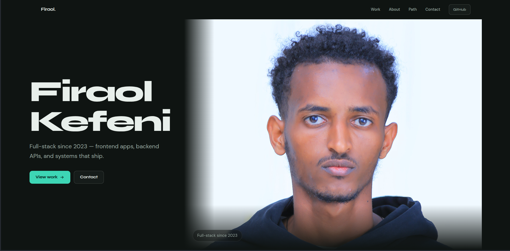

# Firaol Kefeni — Portfolio

A fast, animated personal portfolio built with React, TypeScript, and Vite. It showcases my projects, skills, and background, with smooth scrolling and polished motion throughout.

**Live site:** [https://firaol-kefeni.vercel.app/](https://firaol-kefeni.vercel.app/)



## Features

- Smooth, inertial scrolling powered by Lenis
- Fluid animations and transitions with Framer Motion
- Fully responsive layout for mobile, tablet, and desktop
- Type-safe codebase with TypeScript
- Lightning-fast dev server and optimized builds with Vite
- [Add or remove: dark/light mode, contact form, project filters, etc.]

## Tech Stack

| Category   | Tools         |
| ---------- | ------------- |
| Framework  | React 19      |
| Language   | TypeScript    |
| Build tool | Vite 7        |
| Animation  | Framer Motion |
| Scrolling  | Lenis         |
| styling    | vanilla CSS   |

## Getting Started

### Prerequisites

- [Node.js](https://nodejs.org/) 18 or newer
- npm

### Installation

```bash
git clone https://github.com/Firakef1/portfolio.git
cd portfolio
npm install
```

### Development

```bash
npm run dev
```

Then open the local URL shown in your terminal (usually `http://localhost:5173`).

### Production Build

```bash
npm run build
npm run preview
```

The optimized output is generated in the `dist/` folder.

## Project Structure

```
portfolio/
├── public/          # Static assets (images, icons, favicon)
├── src/             # Components, styles, and application code
├── index.html       # HTML entry point
├── vite.config.ts   # Vite configuration
├── tsconfig.json    # TypeScript configuration
└── package.json
```

## Deployment

This is a static site, so it deploys easily to platforms like [Vercel](https://vercel.com), [Netlify](https://netlify.com), or GitHub Pages.

- **Build command:** `npm run build`
- **Output directory:** `dist`

## Customization

1. Update your personal info, projects, and links in `src/`.
2. Replace images and icons in `public/`.
3. Adjust colors and fonts in your stylesheet(s).

## Contact

- **Email:** [your-email@example.com](mailto:your-email@example.com)
- **GitHub:** [@Firakef1](https://github.com/Firakef1)
- **LinkedIn:** [https://www.linkedin.com/in/firaol-kefeni-649a3b364/](https://www.linkedin.com/in/firaol-kefeni-649a3b364/)

## License

This project is licensed under the [MIT License](./LICENSE). _(Add a `LICENSE` file, or remove this section.)_
